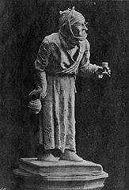

# Plyushkin

/!\ ALPHA STAGE

Tiny one-file cache handler.  
In Php.  
With a whitelist.

## Install

Until production release:

```bash
git clone https://github.com/I-is-as-I-does/Plyushkin.git
```

Also required:

[SSITU/Jack](https://github.com/I-is-as-I-does/Jack): a minimal set of utils.

[SSITU/Blueprints](https://github.com/I-is-as-I-does/Blueprints)

* `FlexLogsTrait` and
* `FlexLogsInterface` specifically.  

This is a Psr-3 "logger aware" implementation with a fallback.  
If no use of other SSITU blueprints, you can download just those two files.

## How to

### Init

```php
use SSITU\Plyushkin\Plyushkin;
require_once 'path/to/autoload.php';

$Plyushkin = new Plyushkin($whitelist = []); 
```

The whitelist consists of a map of supported file types, keys being extensions, values the corresponding mimes.  
Plyushkin provides a default one.

```php
protected $whitelist = [
        "jpg" => "image/jpeg",
        "jpeg" => "image/jpeg",
        "gif" => "image/gif",
        "png" => "image/png",
        "webm" => "video/webm",
        "webp" => "image/webp",
        "mp4" => "video/mp4",
        "mp3" => "audio/mp3",
        "pdf" => "application/pdf",
        "svg" => "image/svg+xml",
        "ico" => "image/x-icon",
        "xml" => "application/xml",
        "json" => "application/json",
        "html" => "text/html",
        "css" => "text/css",
        "js" => "application/javascript"
    ];
```

### Log

```php
# optional:
$Plyushkin->setLogger($somePsr3Logger);
# alternatively, you can retrieve logs that way:
$Plyushkin->getLocalLogs();
// if no logger set: returns all logs history;
// else: only last entry
```

### Run

```php
$Plyushkin->outputFileCache(string $cachePath);
$Plyushkin->saveCache(string $buffer, string $cachePath);
$Plyushkin->saveCacheAndOutput(string $buffer, string $cachePath);
$Plyushkin->cleanCacheDir(string $cacheDir, array $targetExts = []);
$Plyushkin->deleteCacheFile(string $cachePath);
```

`$buffer` is usually what your template engine may return.  
Or, Jack's `buffrInclude` method:

```php
public static function buffrInclude(string $path, mixed $v_ = null)
    {
        if (file_exists($path)) {
            ob_start();
            include $path;
            return ob_get_clean();
        }
        return false;
    }
```

`$v_` being *something* used in the included file, like a variable, an associative array, an object, a callback...

## Contributing

Sure! :raised_hands:
You can take a loot at [CONTRIBUTING](CONTRIBUTING.md).

## License

This project is under the MIT License; cf. [LICENSE](LICENSE) for details.


